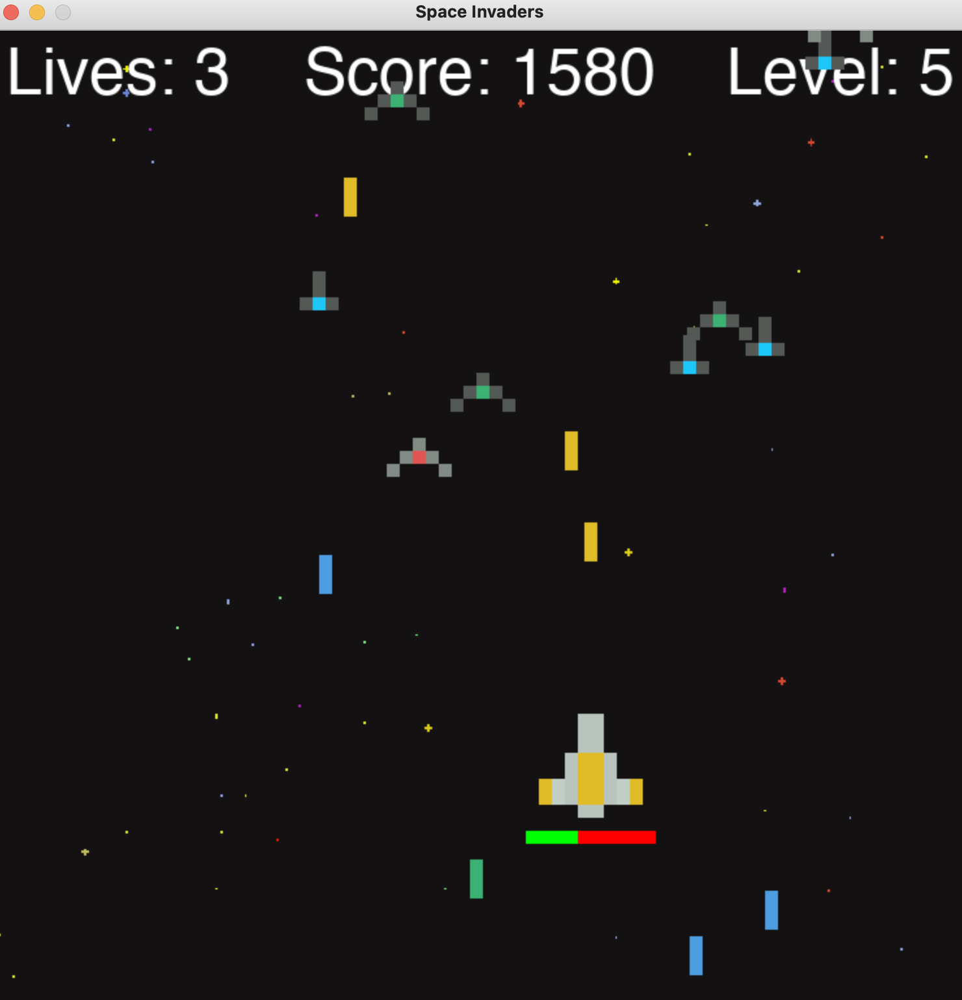

# Space Invaders

### Description

This program allows the user to play a game of Space Invaders.

### Functionality

Rules:
- If an invader reaches the bottom of the screen, you lose one life.
- If you crash into an invader, you lose health.
- The number of invaders increases with each level.
- After each level, you regain half of the health which you have lost.

How to Play:
- After launching, begin gameplay by pressing any key or mouse button. 
- Play as many games of Space Invaders as you want. 
- You will return to the main menu after each game, where you can see your updated high score.
- You can quit at any time by pressing the red 'x' or by pressing 'esc' during gameplay.

### Imports

This game was built using the *Pygame* library. It also uses the *os* module for getting asset file paths, 
the *sys* module for quiting, the *time* module for sleeping, and the *random* module for choosing invader spawn 
locations and firing frequencies.

### Example Gameplay

### GitHub Repository

[Link](https://github.com/mjschwarz/SpaceInvaders.git)

### Credits

This project was inspired by a video from *Tech With Tim*. Certain project elements such as the background and ship
visual assets were provided by *Tech With Tim*.